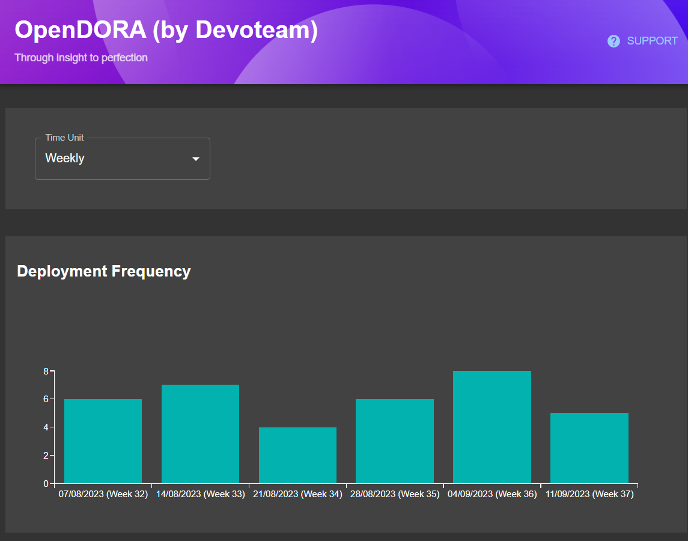

# OpenDORA

Team performance observability for your organization!

OpenDORA is an open-source plugin for [Backstage](https://backstage.io), a popular developer portal platform. It integrates with [Apache DevLake](https://devlake.apache.org) to organize and aggregate data from deployment and project management tooling like Gitlab, GitHub, Jira, and Jenkins. OpenDORA extracts meaningful insights from this data through its API, and provides dashboards within Backstage to benchmark the teams' performance.

## What are DORA metrics?

DORA, short for [DevOps Research and Assessment](https://dora.dev), was created 6 years ago by researchers from data from thousands of teams, to find a reliable way to measure software team performance. The key 4 DORA metrics are: Deployment frequency, Lead time to changes, Change failure rate, and Mean time to recovery. Today, DORA metrics are widely accepted as a framework to determine stability and velocity of teams.

## How does it work?

The ingest script fetches data from external tools (Gitlab, Jira, etc) and pushes to Devlake, ideally run as a scheduled job. The `devlake-go` API exposes this data and provides API endpoints to retrieve it from Devlake. The `backstage-plugin` utilizes this API and renders the results on the Backstage frontend. This is a React plugin based on Material UI.

The resulting plugin as displayed within Backstage:

Below is a description of the main components of this repo.

### backstage-plugin

This is a [Backstage](https://backstage.io) plugin setup used to develop the frontend plugin.

[More details](backstage-plugin/README.md)

### devlake-go

This contains the docker image and configuration scripts to setup DevLake to properly ingest the DORA metrics from a GitLab repo and group them according to Backstage groups.

[More details](devlake-go/README.md)

### dora-api-mock

This is a basic Spring application used to provide a mock for the DORA API metric datapoints. This can be used to develop the frontend plugin without needing to setup the local backend API.

[More details](dora-api-mock/README.md)

### dev-environment

Contains an initial docker compose with the services needed to test the metrics in the dev's local environment.

[More details](dev-environment/README.md)

## Setup

Goto [Plugin setup documentation](backstage-plugin/plugins/open-dora/README.md) and follow the steps to install and setup the plugin in your Backstage environment.

## Contributor Guide

See [Contribution Guidelines](CONTRIBUTING.md) page.
